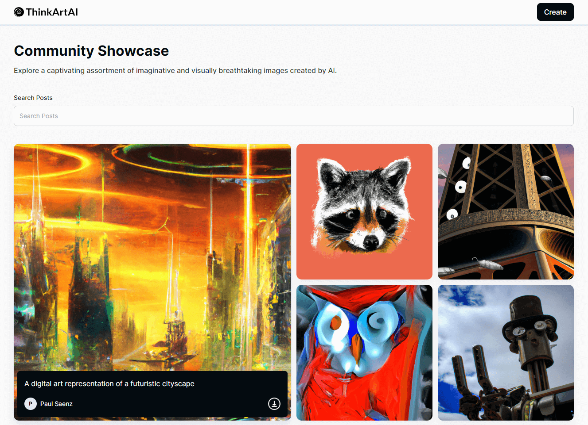

<a name="readme-top"></a>

<div align="center">

  
  <br/>

</div>

<!-- TABLE OF CONTENTS -->

# 📗 Table of Contents

- [📖 About the Project](#about-project)
  - [🛠 Built With](#built-with)
  - [🚀 Live Demo](#live-demo)
- [💻 Getting Started](#getting-started)
  - [Prerequisites](#prerequisites)
  - [Setup](#setup)
  - [Install](#install)
  - [Usage](#usage)
- [👥 Authors](#authors)
- [🤝 Contributing](#contributing)
- [⭐️ Show your support](#support)
- [🙏 Acknowledgements](#acknowledgements)
- [📝 License](#license)

<!-- PROJECT DESCRIPTION -->

# 📖 ThinkArt <a name="about-project"></a>

**ThinkArt** is a DALL-E clone using a fusion of React, Tailwind CSS, and Vite that brings creativity to life. Integrated with Node, Express, MongoDB, OpenAI, and Cloudinary, it empowers users to explore art through AI technology. Unleash creativity, and share masterpieces on this dynamic platform.



</br>

## 🛠 Built With <a name="built-with"></a>


<details>
  <summary>Frontend</summary>
  <ul>
    <li>HTML</li>
    <li>CSS</li>
    <li>JavaScript</li>
    <li>Tailwind CSS</li>
    <li>React</li>
    <li>Vite</li>
  </ul>
</details>

<details>
  <summary>Backend</summary>
  <ul>
    <li>Node</li>
    <li>Express</li>
    <li>MongoDB</li>
    <li>OpenAI</li>
    <li>Cloudinary</li>
  </ul>
</details>

<!-- LIVE DEMO -->

## 🚀 Live Demo <a name="live-demo"></a>

- [Coming soon...]()

<p align="right">(<a href="#readme-top">Back to top</a>)</p>

<!-- GETTING STARTED -->

## 💻 Getting Started <a name="getting-started"></a>

To get a local copy up and running, follow these steps.

### Prerequisites

- Node.js
- MongoDB
- Cloudinary
- OPenAI
- Visual Studio Code
- Git Bash
- NPM installed locally

### Setup

Clone this repository to your desired folder:

```sh
git clone https://github.com/HunterX-7/ThinkArt.git
```

### Install

Install this project run the following command in the frontend and backend folder:

```sh
npm install
```

### Usage

To run the frontend side of the project, execute the following command:

```sh
npm run dev
```

To run the backend side of the project, execute the following command:

```sh
npm start
```

<!-- AUTHORS -->

## 👥 Author <a name="authors"></a>

👤 **Francisco Quintero**

- GitHub: [@HunterX-7](https://github.com/HunterX-7)
- LinkedIn: [Francisco Quintero](https://www.linkedin.com/in/francisco-asis-quintero-cede%C3%B1o/)

<!-- CONTRIBUTING -->

## 🤝 Contributing <a name="contributing"></a>

Contributions, issues, and feature requests are welcome!

Feel free to check the [issues page](https://github.com/HunterX-7/ThinkArt/issues).

<!-- SUPPORT -->

## ⭐️ Show your support <a name="support"></a>

Give a ⭐️ if you like this project!

<!-- Acknowledgments -->

## 🙏 Acknowledgments <a name="acknowledgements"></a>

Hat tip to anyone whose code was used.

<!-- LICENSE -->

## 📝 License <a name="license"></a>

This project is [MIT](./LICENSE) licensed.

<p align="right">(<a href="#readme-top">Back to top</a>)</p>
